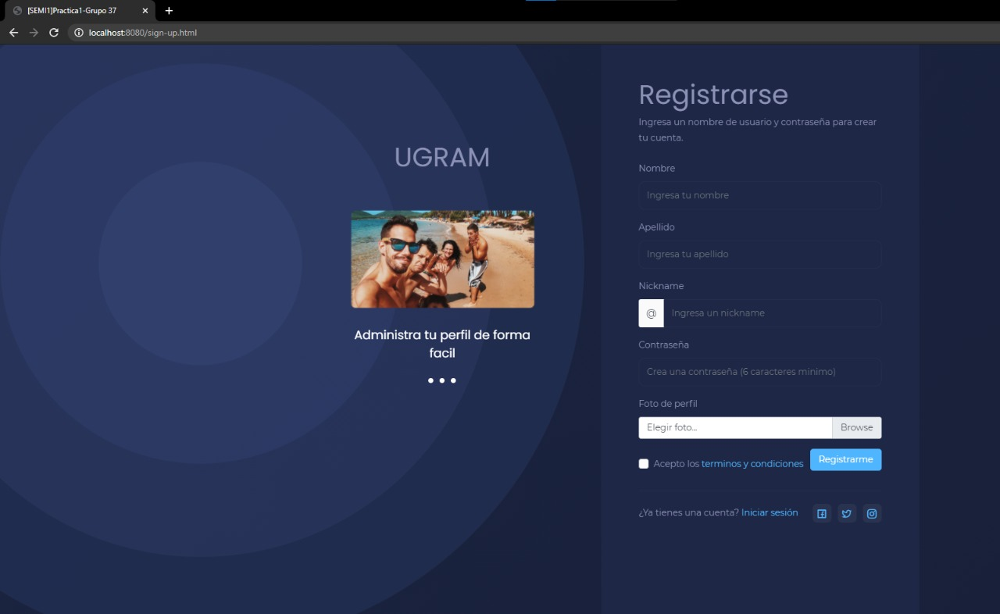
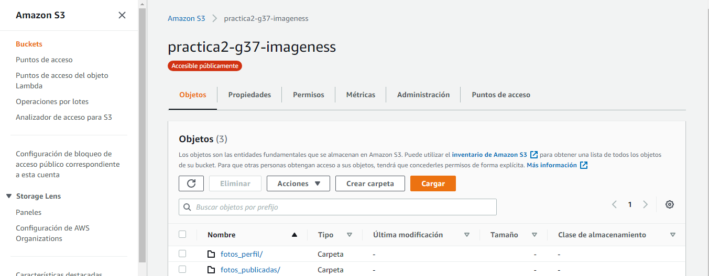

# MANUAL DE CONFIGURACIONES
El siguiente manual, muestra los pasos a seguir para configurar los servicios de AWS que se utilizaron para resolver la práctica.

## Datos del Estudiante
Ronald Geovany Ordoñez Xiloj - 201314564                 
Gonzalo Antonio Garcia Solares - 201318652

## Descripcion de la arquitectura 
FrontEnd: Plantilla utilizando javascript y bootstrap

BackEnd: Un Servidor que se comunican con AWS programado en Nodejs, montado en una instancia EC2, el servidor se comunica con un bucket de imagenes S3, una base de datos en Dynamo ademas utliza servicios de Rekognition para detectar la cara de un usuario o identificar etiquetas.

## Perfil del Usuario
Los usuario luego de iniciar sesion les mostrará su perfil con el analisis de su foto de perfil con unas etiquetas al pie de la foto.

## Subir Imagen
Los usuario pueden subir sus propias imagenes las cuales son analizadas y con base en el analisis, cada foto subida es asignada a un album de acuerdo a las etiquetas que hacen match con la fotografia.

## Extraer Texto
Los usuario pueden subir imagenes que contengan texto como diapositivas o fotos de un pizarron y despues de un analisis les sera devuelto el texto que contiene la imagen.

## INSTANCIAS EC2
Primero que nada se creara un usuario IAM, para uso especifico del servicio EC2 de Amazon Web Services.

Se observa que el usuario no tiene permisos de administrador, pues no puede ver los demas usuarios IAM en la cuenta.
Hecho esto, se creará la instancia en donde se crearán los servidores, esto es tanto para el servidor de Node.js y de Python.

En nuestro caso usamos una instancia Ubuntu Server 20.04, con almacenamiento de 8GB (que cubre la capa gratuita de AWS).
Y en esta instancia, o máquina virtual, estaremos trabajando y levanddo nuestro servidor.

Para permitir el trafico en el puerto que estara trabajando nuestro servidor, se debe de agregar una regla de seguridad.
Desde la consola de EC2 en AWS, se selecciona *seguridad* de nuestra instancia.

Luego, se presiona clic en el Grupo de seguridad y estando ahi seleccionamos *Editar seguridad*.

Agregamos una regla *TCP personalizado* con el puerto que usaremos y con origen 0.0.0.0/0 para permitir todo el trafico en dicho puerto. Luego clicamos en *Guardar*.

Con esto ya se permite el acceso en el puerto que usara nuestro servidor.

## IAM

## S3

## DYNAMO

